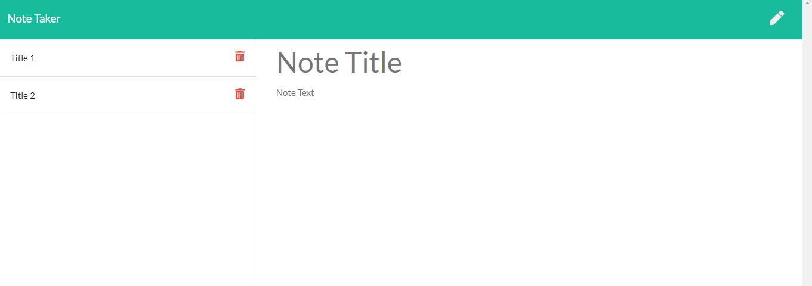

# Note-Taker

## Description
This node server side application is developed for the users to write, save and delete notes. The `Express.js` framework is used for quickly and easily establish our API routes and associated HTTP request methods.
## Installation
        
        Clone the repository to your local machine and install npm and run server.js from your terminal.

## Usage

* Here You can run the application [Heroku Application](https://secret-anchorage-44838.herokuapp.com/)
## Credits
* https://www.freecodecamp.org/news/
* https://expressjs.com/
## Tests
none
